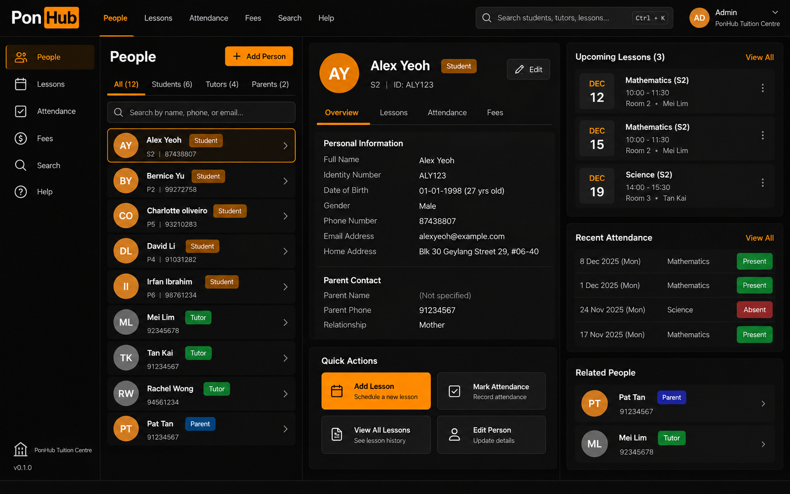

# PonHub

PonHub helps tuition centre administrators manage students, tutors, lessons, and attendance through a fast, keyboard-focused interface.

Built for admins who like to keep both hands on the keyboard, PonHub lets you find the people you need, arrange lessons, and keep track of who showed up — without all the unnecessary clicking.

- **Find who you're looking for, fast.** Search students, tutors, parents, and lessons using a powerful command-based interface.
- **Manage your talent.** Add students and tutors, assign lessons, and make sure nobody gets double-booked.
- **Keep attendance under control.** Mark who's present, who's absent, and correct mistakes when things get a little messy.
- **Get straight to the action.** PonHub is designed around a CLI-style workflow for users who prefer typing commands over navigating endless menus.
- **Everything in one place.** Student details, parent contacts, lesson schedules, and attendance records are kept organised and easy to access.

PonHub is made for tuition centre admins who want their administrative work to be **quick, smooth, and satisfying**.

Because managing attendance shouldn't be hard.

##### Acknowledgements

- This project is based on the AddressBook-Level3 project created by the [SE-EDU initiative](https://se-education.org).

This project is based on the AddressBook-Level3 project created by the [SE-EDU initiative](https://se-education.org).
