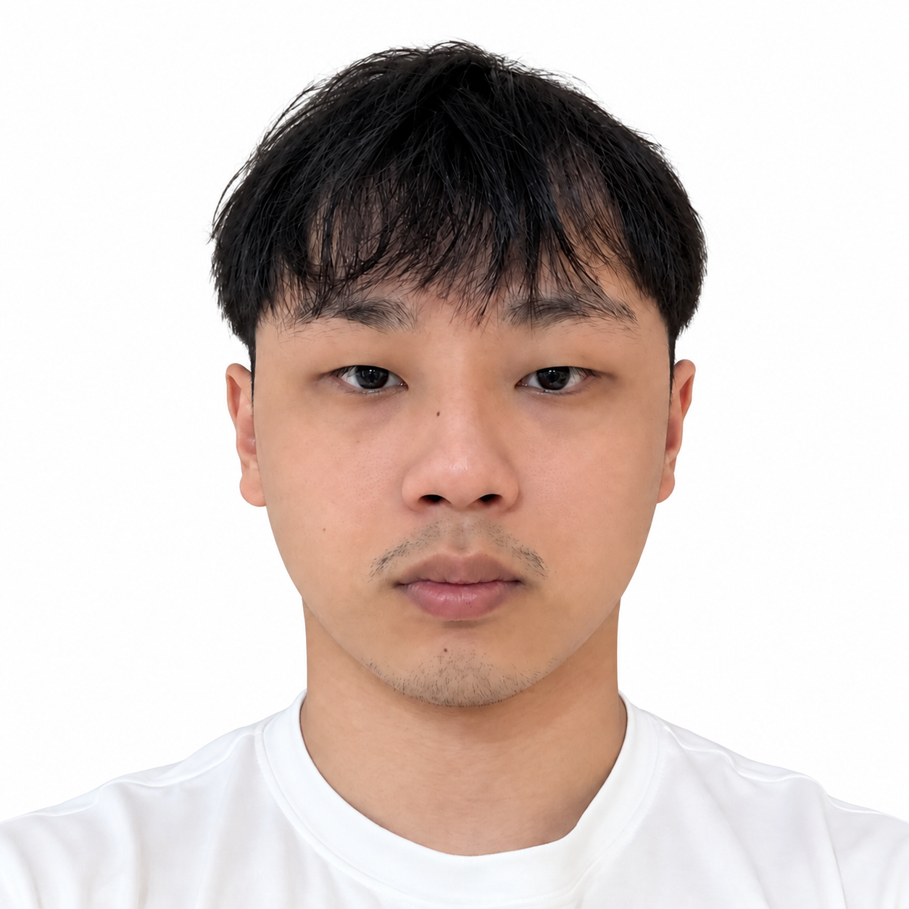
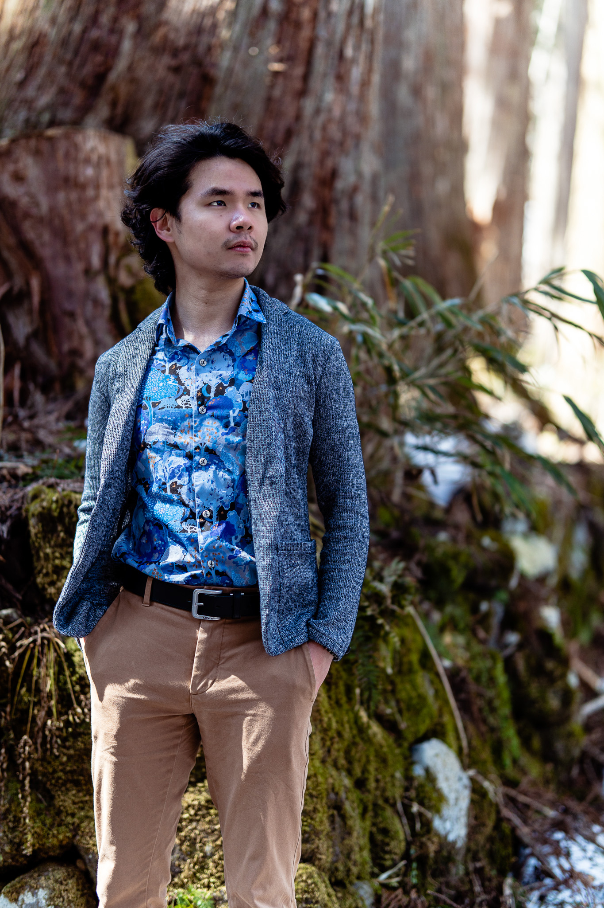
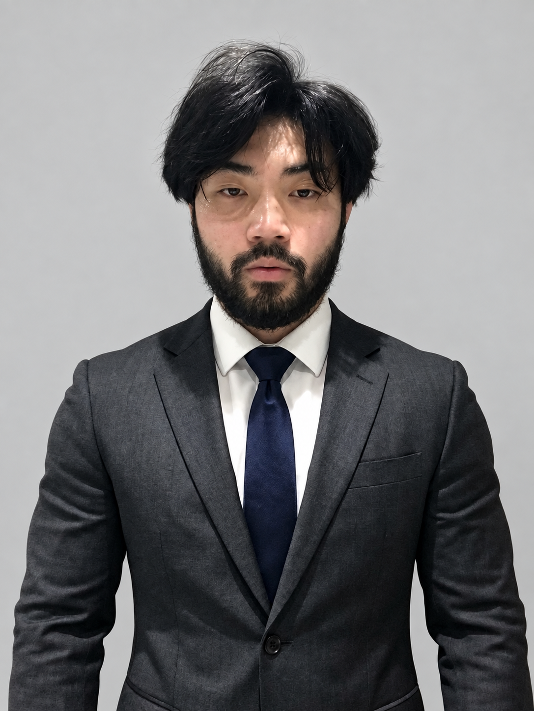
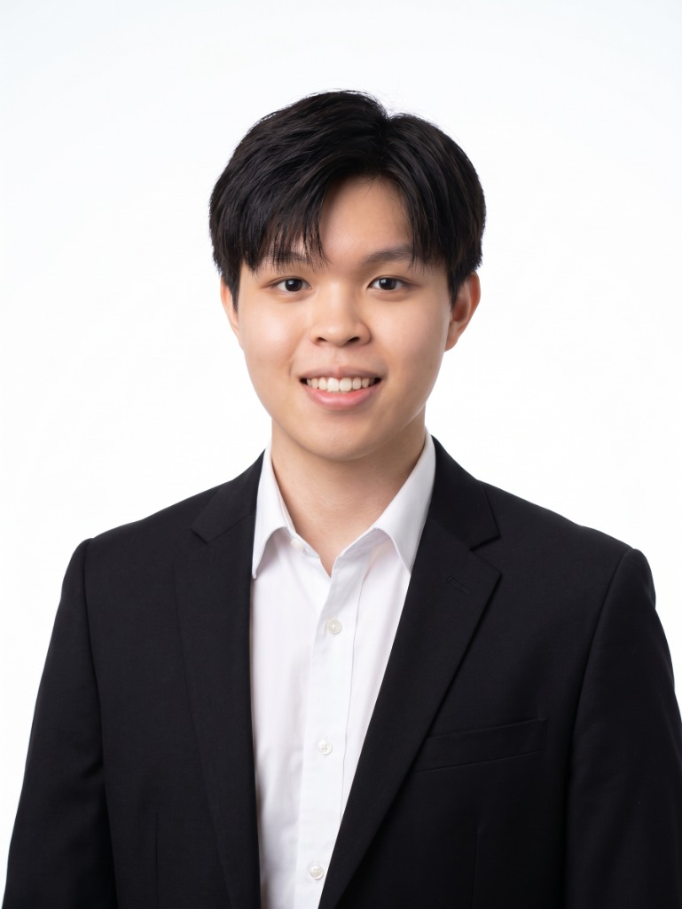
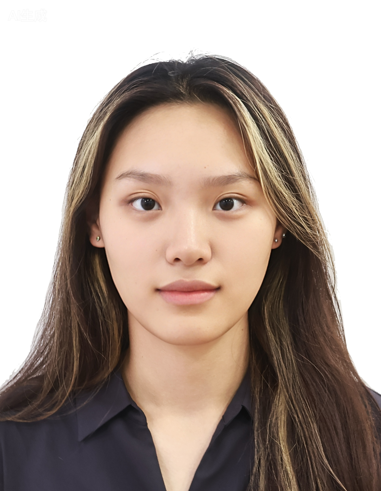

We are a team based in the [School of Computing, National University of Singapore](https://www.comp.nus.edu.sg).

You can reach us at the email `seer[at]comp.nus.edu.sg`

## Project team

### Zhu Zhi Yu

[[github](https://github.com/ultramanarm)]

* Role: Developer
* Responsibilities: Testing + Data, Developer Guide

### Vincent Lin

[[github](https://github.com/gugrusaurus)]

* Role: Deliverables and Deadline
* Responsibilities: Ensure project deliverables are done on time and in the right format.

### Benjamin Ng

[[github](https://github.com/ben58882)]

* Role: Developer (Model, UI and Storage)
* Responsibilities:
  * Develop Model filtering and UI results for search and lesson-information retrieval.
  * Maintain Storage persistence for person and lesson records.
  * Write Developer Guide use cases.

### Ernest Chua

[[github](https://github.com/ErnestChuaa)]

* Role: Code Quality, Documentation
* Responsibilities: In charge of documentation quality and code quality

### Yang Shuo

[[github](https://github.com/ys000009)]

* Role: Developer
* Responsibilities: DevOps + Integration
