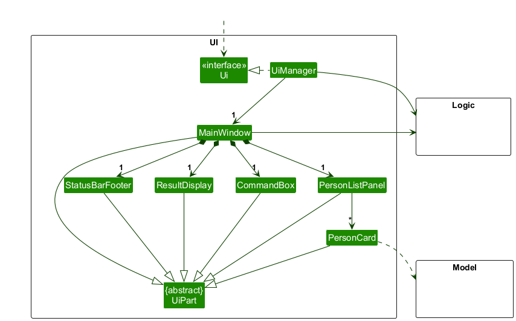
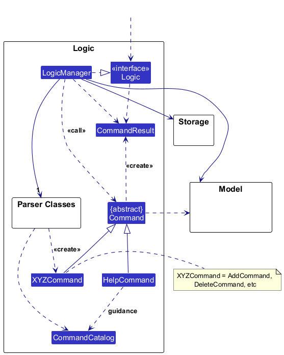
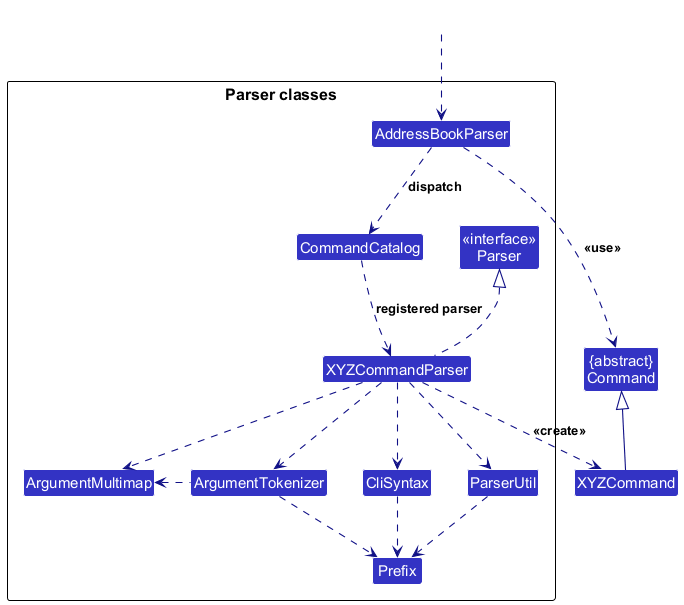

* Table of Contents
{:toc}

--------------------------------------------------------------------------------------------------------------------

## **Acknowledgements**

* _{List the sources of reused or adapted ideas, code, documentation, and third-party libraries here, with links to the originals.}_

--------------------------------------------------------------------------------------------------------------------

## **Setting up, getting started**

Refer to the guide [_Setting up and getting started_](SettingUp.md).

--------------------------------------------------------------------------------------------------------------------

## **Design**

:bulb: **Tip:** The `.puml` files used to create diagrams are in `docs/diagrams`. Refer to the [_PlantUML Tutorial_ at se-edu/guides](https://se-education.org/guides/tutorials/plantUml.html) to learn how to create and edit diagrams.

### Architecture

The ***Architecture Diagram*** given above explains the high-level design of the App.

The following provides a quick overview of the main components and their interactions.

**Main components of the architecture**

**`Main`** (consisting of classes [`Main`](https://github.com/se-edu/addressbook-level3/tree/master/src/main/java/seedu/address/Main.java) and [`MainApp`](https://github.com/se-edu/addressbook-level3/tree/master/src/main/java/seedu/address/MainApp.java)) is in charge of the app launch and shut down.
* At app launch, it initializes the other components in the correct sequence, and connects them up with each other.
* At shut down, it shuts down the other components and invokes cleanup methods where necessary.

The bulk of the app's work is done by the following four components:

* [**`UI`**](#ui-component): The UI of the App.
* [**`Logic`**](#logic-component): The command executor.
* [**`Model`**](#model-component): Holds the data of the App in memory.
* [**`Storage`**](#storage-component): Reads data from, and writes data to, the hard disk.

[**`Commons`**](#common-classes) represents a collection of classes used by multiple other components.

**How the architecture components interact with each other**

The *Sequence Diagram* below shows how the components interact with each other for the scenario where the user issues the command `delete 1`.

Each of the four main components (also shown in the diagram above),

* defines its *API* in an `interface` with the same name as the Component.
* provides its functionality through a concrete `{Component Name}Manager` class that implements the corresponding API interface.

For example, the `Logic` component defines its API in `Logic.java` and implements it in `LogicManager.java`. Other components interact with a component through its interface rather than its concrete class, preventing them from coupling to that component's implementation, as illustrated in the following partial class diagram.

The sections below give more details of each component.

### UI component

The **API** of this component is specified in [`Ui.java`](https://github.com/se-edu/addressbook-level3/tree/master/src/main/java/seedu/address/ui/Ui.java)

The UI consists of a `MainWindow` and its parts, such as `CommandBox`, `ResultDisplay`, `PersonListPanel`, and `StatusBarFooter`. All of these, including `MainWindow`, inherit from the abstract `UiPart` class, which captures common behavior among classes that represent visible GUI parts.

The `UI` component uses the JavaFX UI framework. The layouts of these UI parts are defined in matching `.fxml` files in `src/main/resources/view`. For example, [`MainWindow.fxml`](https://github.com/se-edu/addressbook-level3/tree/master/src/main/resources/view/MainWindow.fxml) specifies the layout of [`MainWindow`](https://github.com/se-edu/addressbook-level3/tree/master/src/main/java/seedu/address/ui/MainWindow.java).

The `UI` component,

* executes user commands using the `Logic` component.
* listens for changes to `Model` data so that the UI can be updated with the modified data.
* keeps a reference to the `Logic` component, because the `UI` relies on the `Logic` to execute commands.
* depends on some classes in the `Model` component because it displays `Person` objects from the model.

### Logic component

**API** : [`Logic.java`](https://github.com/se-edu/addressbook-level3/tree/master/src/main/java/seedu/address/logic/Logic.java)

Here's a (partial) class diagram of the `Logic` component:

The sequence diagram below illustrates the interactions within the `Logic` component, taking `execute("delete 1")` API call as an example.

:information_source: **Note:** The lifeline for `DeleteCommandParser` should end at the destroy marker (X), but due to a limitation of PlantUML, it continues to the end of the diagram.

How the `Logic` component works:

1. When `Logic` is called upon to execute a command, the command is passed to an `AddressBookParser` object, which in turn creates a parser that matches the command (e.g., `DeleteCommandParser`) and uses it to parse the command.
1. This results in a `Command` object (more precisely, an object of one of its subclasses e.g., `DeleteCommand`) which is executed by the `LogicManager`.
1. The command can communicate with the `Model` when it is executed (e.g. to delete a person). 
   Note that although this is shown as a single step in the diagram above for simplicity, the code can require several interactions between the command object and the `Model` to complete the operation.
1. The result of the command execution is encapsulated as a `CommandResult` object which is returned from `Logic`.

Here are the other classes in `Logic` (omitted from the class diagram above) that are used for parsing a user command:

How the parsing works:
* When called upon to parse a user command, the `AddressBookParser` class creates an `XYZCommandParser` (`XYZ` is a placeholder for the specific command name, e.g., `AddCommandParser`). The parser uses the other classes shown above to parse the user command and create an `XYZCommand` object (e.g., `AddCommand`). The `AddressBookParser` returns that object as a `Command` object.
* All `XYZCommandParser` classes, such as `AddCommandParser` and `DeleteCommandParser`, implement the `Parser` interface so they can be treated similarly where appropriate, for example during testing.

### Model component
**API** : [`Model.java`](https://github.com/se-edu/addressbook-level3/tree/master/src/main/java/seedu/address/model/Model.java)

The `Model` component,

* stores the address book data i.e., all `Person` objects (which are contained in a `UniquePersonList` object).
* stores the `Person` objects selected by the current filter, such as search results, in a separate _filtered_ list. It exposes this list as an unmodifiable `ObservableList<Person>` that the UI can observe and bind to, so the UI updates when the list changes.
* stores a `UserPrefs` object that represents the user’s preferences (currently, just the GUI settings). This is exposed to the outside as a `ReadOnlyUserPrefs` object.
* does not depend on any of the other three components (as the `Model` represents data entities of the domain, they should make sense on their own without depending on other components)

:information_source: **Note:** The alternative, arguably more object-oriented, design below keeps a unique list of tags in `AddressBook`, and each `Person` references tags from that list. This lets `AddressBook` maintain one `Tag` object per unique tag instead of each `Person` holding its own `Tag` objects. 

### Storage component

**API** : [`Storage.java`](https://github.com/se-edu/addressbook-level3/tree/master/src/main/java/seedu/address/storage/Storage.java)

The `Storage` component,
* can save both address book data and user preference data in JSON format, and read them back into corresponding objects.
* is implemented by `StorageManager`, which delegates the actual JSON file access to `JsonAddressBookStorage` and `JsonUserPrefsStorage` (one class per data file).
* depends on some classes in the `Model` component (because the `Storage` component's job is to save/retrieve objects that belong to the `Model`)

### Common classes

Classes used by multiple components are in the `seedu.address.commons` package.

--------------------------------------------------------------------------------------------------------------------

## **Implementation**

This section describes some noteworthy details on how certain features are implemented.

### \[Proposed\] Undo/redo feature

#### Proposed Implementation

The proposed undo/redo mechanism is facilitated by `VersionedAddressBook`. It extends `AddressBook` with an undo/redo history, stored internally as an `addressBookStateList` and `currentStatePointer`. Additionally, it implements the following operations:

* `VersionedAddressBook#commit()` — Saves the current address book state in its history.
* `VersionedAddressBook#undo()` — Restores the previous address book state from its history.
* `VersionedAddressBook#redo()` — Restores a previously undone address book state from its history.

These operations are exposed in the `Model` interface as `Model#commitAddressBook()`, `Model#undoAddressBook()` and `Model#redoAddressBook()` respectively.

Given below is an example usage scenario and how the undo/redo mechanism behaves at each step.

Step 1. The user launches the application for the first time. The `VersionedAddressBook` will be initialized with the initial address book state, and the `currentStatePointer` pointing to that single address book state.

Step 2. The user executes `delete 5` command to delete the 5th person in the address book. The `delete` command calls `Model#commitAddressBook()`, causing the modified state of the address book after the `delete 5` command executes to be saved in the `addressBookStateList`, and the `currentStatePointer` is shifted to the newly inserted address book state.

Step 3. The user executes `add n/David …​` to add a new person. The `add` command also calls `Model#commitAddressBook()`, causing another modified address book state to be saved into the `addressBookStateList`.

:information_source: **Note:** If a command fails its execution, it will not call `Model#commitAddressBook()`, so the address book state will not be saved into the `addressBookStateList`.

Step 4. The user now decides that adding the person was a mistake, and decides to undo that action by executing the `undo` command. The `undo` command will call `Model#undoAddressBook()`, which will shift the `currentStatePointer` once to the left, pointing it to the previous address book state, and restores the address book to that state.

:information_source: **Note:** If the `currentStatePointer` is at index 0, pointing to the initial AddressBook state, then there are no previous AddressBook states to restore. The `undo` command uses `Model#canUndoAddressBook()` to check if this is the case. If so, it will return an error to the user rather
than attempting to perform the undo.

The following sequence diagram shows how an undo operation goes through the `Logic` component:

:information_source: **Note:** The lifeline for `UndoCommand` should end at the destroy marker (X), but due to a limitation of PlantUML, it continues to the end of the diagram.

Similarly, how an undo operation goes through the `Model` component is shown below:

The `redo` command does the opposite — it calls `Model#redoAddressBook()`, which shifts the `currentStatePointer` once to the right, pointing to the previously undone state, and restores the address book to that state.

:information_source: **Note:** If the `currentStatePointer` is at index `addressBookStateList.size() - 1`, pointing to the latest address book state, then there are no undone AddressBook states to restore. The `redo` command uses `Model#canRedoAddressBook()` to check if this is the case. If so, it will return an error to the user rather than attempting to perform the redo.

Step 5. The user then decides to execute the command `list`. Commands that do not modify the address book, such as `list`, will usually not call `Model#commitAddressBook()`, `Model#undoAddressBook()` or `Model#redoAddressBook()`. Thus, the `addressBookStateList` remains unchanged.

Step 6. The user executes `clear`, which calls `Model#commitAddressBook()`. Since the `currentStatePointer` is not pointing at the end of the `addressBookStateList`, all address book states after the `currentStatePointer` will be purged. Reason: It no longer makes sense to redo the `add n/David …​` command. This is the behavior that most modern desktop applications follow.

The following activity diagram summarizes what happens when a user executes a new command:

#### Design considerations:

**Aspect: How undo & redo execute:**

* **Alternative 1 (current choice):** Saves the entire address book.
  * Pros: Easy to implement.
  * Cons: May have performance issues in terms of memory usage.

* **Alternative 2:** Individual command knows how to undo/redo by
  itself.
  * Pros: Will use less memory (e.g. for `delete`, just save the person being deleted).
  * Cons: We must ensure that the implementation of each individual command is correct.

_{more aspects and alternatives to be added}_

### \[Proposed\] Data archiving

_{Explain here how the data archiving feature will be implemented}_

--------------------------------------------------------------------------------------------------------------------

## **Documentation, logging, testing, dev-ops**

* [Documentation guide](Documentation.md)
* [Testing guide](Testing.md)
* [Logging guide](Logging.md)
* [DevOps guide](DevOps.md)

--------------------------------------------------------------------------------------------------------------------

## **Appendix: Requirements**

### Product scope

**Target user profile**: Tuition centre administrative staff who maintain student, tutor and parent records and coordinate lessons and attendance.

* **Usage context**: During enrolment, timetable planning and daily lesson administration, staff need to find contacts, allocate tutors and rooms, record attendance, and follow up on absences and lesson changes.
* **User characteristics**: Staff understand tuition operations and work repeatedly with names, contact details, student levels and lesson schedules. They need quick record retrieval, clear feedback on invalid changes, and command examples while learning the application.
* **Current problems**: Keeping contact details, schedules and attendance consistent requires repeated checking. Staff need to avoid tutor or room clashes, find the right parent contact promptly, and identify missed lessons that need follow-up.

**Value proposition**: For tuition centre administrative staff who need to keep people, lessons and attendance organised, PonHub provides a single place to manage and search these records, with scheduling checks and attendance tracking to support reliable daily administration.

Compared with maintaining separate contact lists, timetables and attendance records, PonHub connects the information needed for routine tasks and checks conflicting or invalid changes. Planned requirements such as make-up booking extend this support to absence follow-up.

### User stories

These stories describe identified requirements, including requirements beyond the MVP; they do not imply completed functionality.

Priorities: **High** (must-have core requirements), **Medium** (useful extensions), **Low** (future consideration).
Medium and Low priorities are proposed.

**† Scope to reconcile**: US-17 to US-20 retain the 15 September planning notes' must-have designation for shared classes,
capacity, enrolment, and make-up booking. These workflows need reconciliation with the feature specification's per-student
recurring lesson model before implementation. Starting a make-up booking directly from an absence (US-48) is a separate
Medium-priority extension.

| ID | Priority | As a … | I want to … | So that I can … |
| --- | --- | --- | --- | --- |
| US-01 | High | tuition centre administrator | add students with their level and parent contact number | keep student records and contact a parent when needed. |
| US-02 | High | tuition centre administrator | add tutors with their contact details | maintain the information needed for lesson allocation and communication. |
| US-03 | High | tuition centre administrator | keep optional separate parent contact records | find parent details independently of a student's record. |
| US-04 | High | tuition centre administrator | list all people or only students, parents or tutors | review the relevant records quickly. |
| US-05 | High | tuition centre administrator | search student, parent and tutor records by identifying details and find parents or tutors associated with a student or lesson | retrieve the right contact information promptly. |
| US-06 | High | tuition centre administrator | filter relevant student and lesson records by tutor, subject or lesson day | find the records needed for a specific teaching session. |
| US-07 | High | tuition centre administrator | remove obsolete person records while preventing removal of records still referenced by lessons or attendance | keep the records tidy without breaking existing links. |
| US-08 | High | tuition centre administrator | add a student's recurring lesson with its day, time, subject, tutor and room | maintain an organised teaching schedule. |
| US-09 | High | tuition centre administrator | have proposed lessons that conflict with existing tutor or room bookings rejected | avoid double-booking teaching resources. |
| US-10 | High | tuition centre administrator | remove an unneeded recurring lesson only when it has no linked attendance records | keep the schedule current without breaking attendance links. |
| US-11 | High | tuition centre administrator | mark a student present or absent for a particular lesson and date | keep an accurate record of each lesson occurrence. |
| US-12 | High | tuition centre administrator | correct or remove an erroneous attendance entry without deleting the lesson | fix recording mistakes while preserving the schedule. |
| US-13 | High | tuition centre administrator | view available commands with their syntax and examples | learn how to complete tasks and recover from command mistakes. |
| US-14 | High | tuition centre administrator | have successful changes saved and available when I reopen PonHub | continue my work without re-entering records. |
| US-15 | High | tuition centre administrator | have attempts to add an exact duplicate person record rejected | avoid storing the same record twice. |
| US-16 | High | tuition centre administrator | view a tutor's weekly timetable | tell the tutor which lessons they are assigned to teach. |
| US-17 | High† | tuition centre administrator | check a class roster and its remaining places | decide whether a new enrolment or make-up student can be accommodated. |
| US-18 | High† | tuition centre administrator | enrol a student in a class or remove their enrolment | keep class membership and available places up to date. |
| US-19 | High† | tuition centre administrator | reserve a one-off place in a suitable class for a student who missed a lesson | arrange a make-up lesson without changing the student's regular schedule. |
| US-20 | High† | tuition centre administrator | create a named recurring class with its tutor, day, time, room and capacity | organise teaching slots for a group of students. |
| US-21 | Medium | tuition centre administrator | identify students who missed a lesson | follow up with parents and decide whether make-up arrangements or fee adjustments are needed. |
| US-22 | Medium | tuition centre administrator | sort students by name and filter or group them by level | review the relevant records in a clear order. |
| US-23 | Medium | tuition centre administrator | archive withdrawn students, hide them from the default active list and restore them when needed | keep the active list manageable while retaining past records. |
| US-24 | Medium | tuition centre administrator | maintain a waiting list for a full class | offer newly available places in the order students joined the list. |
| US-25 | Medium | tuition centre administrator | track pending class-swap requests | follow up on outstanding transfers. |
| US-26 | Medium | tuition centre administrator | record lesson feedback from students or parents | follow up on reported concerns. |
| US-27 | Medium | tuition centre administrator | assign a replacement tutor for one lesson occurrence | cover a tutor's absence while retaining the regular tutor for other lessons. |
| US-28 | Medium | tuition centre administrator | cancel one lesson occurrence without deleting its recurring schedule | handle a holiday or closure without rebuilding future lessons. |
| US-29 | Medium | tuition centre administrator | export a class list with student names, class details and contact information | share or print the information needed by tutors. |
| US-30 | Medium | tuition centre administrator | review possible duplicate student matches before saving a new record | avoid duplicate records that are similar but not identical. |
| US-31 | Medium | tuition centre administrator | undo my last change | recover from an accidental edit or deletion. |
| US-32 | Medium | tuition centre administrator | use command shortcuts and an alternative command-help form | complete frequent tasks with less typing. |
| US-33 | Medium | tuition centre administrator | receive command completion, inline input guidance and suggestions for misspelled commands | enter valid commands more easily. |
| US-34 | Medium | tuition centre administrator | record names, contact numbers and education levels beyond the MVP formats | represent a wider range of people accurately. |
| US-35 | Medium | tuition centre administrator | preview the person or lesson affected by a deletion | check its consequences before removing it. |
| US-36 | Medium | tuition centre administrator | reuse recurring lesson templates | assign similar lessons without re-entering the same details. |
| US-37 | Medium | tuition centre administrator | edit an existing lesson directly | update its details without deleting and recreating it. |
| US-38 | Medium | tuition centre administrator | combine alternative search conditions and exclude unwanted matches | express more complex searches. |
| US-39 | Medium | tuition centre administrator | receive spelling suggestions, relevance ordering and highlighted search matches | identify the intended records more easily. |
| US-40 | Medium | tuition centre administrator | save and reuse searches | repeat common lookups without entering every filter again. |
| US-41 | Medium | tuition centre administrator | use a guided advanced-search form and filter completion | construct valid searches without recalling every prefix. |
| US-42 | Medium | tuition centre administrator | browse a long command-help catalogue in manageable pages | read all available help within the application. |
| US-43 | Medium | tuition centre administrator | record late or excused attendance and notes explaining absences | distinguish different attendance circumstances. |
| US-44 | Medium | tuition centre administrator | mark attendance for an entire class in one operation | process attendance efficiently. |
| US-45 | Medium | tuition centre administrator | mark attendance using clickable controls | record attendance without remembering command syntax. |
| US-46 | Medium | tuition centre administrator | view attendance percentage summaries | identify patterns that need follow-up. |
| US-47 | Medium | tuition centre administrator | see today's scheduled lessons automatically | start daily attendance work quickly. |
| US-48 | Medium | tuition centre administrator | start a make-up booking directly from a recorded absence | connect follow-up arrangements to the missed lesson. |
| US-49 | Low | tuition centre administrator | track tuition fees and adjustments associated with student attendance | follow up on payments and fee changes when needed. |

### Use cases

For the use cases below, the **System** is `PonHub` and the **Actor** is the tuition centre administrator.
The documented person, lesson, attendance, search, and help operations accept all required details in one keyboard-entered command. PonHub validates each command and saves data changes without requiring a field prompt, preview, or separate confirmation. Guided previews and the class workflows are planned extensions; UC-04's shared-class model still needs reconciliation with the per-student recurring lesson model.

#### UC-01: Add a person record

**Related user stories:** US-01, US-02, US-03, US-14, US-15, US-30, US-34

**Preconditions:** PonHub is running. The administrator has the person's role and required contact details.

**Main success scenario**

1. The administrator enters one `add` command containing the selected role and all required person details.
2. PonHub validates the command, normalizes the details, and checks for an exact duplicate.
3. PonHub saves one new person record, refreshes the person list, and reports success.

**Extensions**

* 1a. A required field is missing, invalid, repeated, or unsupported: PonHub explains the problem without changing data. The administrator may correct and resubmit the command at step 1.
* 2a. An exact duplicate exists: PonHub rejects the addition without changing data, and the use case ends.
* 2b. The administrator explicitly requests a planned guided preview: PonHub shows the normalized record and any possible duplicate matches before saving. The administrator cancels with no change, or confirms and resumes at step 3.
* 3a. Saving fails: PonHub rolls back the addition, reports the failure, and the use case ends.

**Postconditions:** On success, one valid, non-duplicate person record is stored and visible. Existing records are unchanged.

#### UC-02: Find and review operational records

**Related user stories:** US-04, US-05, US-06, US-22, US-29, US-38, US-39, US-40, US-41

**Preconditions:** PonHub is running and has loaded the stored person, lesson, and class records.

**Main success scenario**

1. The administrator enters `list` or one `search` command with a category and any filters needed.
2. PonHub validates the command and searches the relevant records.
3. PonHub displays each distinct match once, with the requested ordering or grouping and relevant relationship context.
4. The administrator opens a result or requests a class-list export.
5. PonHub displays the selected details or generates the requested export.

**Extensions**

* 1a. The administrator uses a planned guided advanced-search form: PonHub supplies valid filters and completion, then submits the completed search at step 2.
* 2a. A condition is invalid or incompatible with the selected category: PonHub explains the valid syntax without changing stored records. The administrator may resubmit at step 1.
* 2b. A command may be misspelled: PonHub suggests the closest valid command. If accepted, the administrator resumes at step 1.
* 3a. No record matches: PonHub displays a successful empty result, and the use case ends.
* 3b. The administrator asks to save the search: PonHub stores the named search and resumes at step 3.
* 5a. The export cannot be generated: PonHub reports the failure without changing stored records, and the use case ends.

**Postconditions:** The requested view is displayed. Stored operational data is unchanged; a saved search or export exists only if requested.

#### UC-03: Schedule and maintain a recurring lesson

**Related user stories:** US-08, US-09, US-10, US-16, US-27, US-28, US-36, US-37, US-47

**Preconditions:** The student and regular tutor records exist. PonHub has loaded current tutor and room bookings.

**Main success scenario**

1. The administrator enters one `addlesson` command with the student's displayed index, day, start and end times, subject, tutor's full name (`tu/`), and room. The administrator also supplies the tutor's phone number (`tp/`) when tutors share that name; it may be supplied for a unique name too.
2. PonHub resolves exactly one tutor by full name, ignoring letter case and repeated spaces, and by exact phone number if supplied. It validates the student, remaining values, time range, and proposed slot against that tutor record's bookings and room bookings.
3. PonHub saves the recurring lesson linked to the resolved tutor record, updates the student's lesson list and affected timetables, and reports success.

**Extensions**

* 1a. The administrator enters `deletelesson INDEX LESSON_INDEX` instead. PonHub validates both indices and checks for linked attendance. If none exists, PonHub removes and saves the selected lesson, renumbers the remaining lessons, frees its tutor and room booking, and reports success. The use case ends.
* 1a1. The selected lesson has linked attendance: PonHub blocks deletion, identifies the dependency, changes nothing, and the use case ends.
* 1b. The administrator requests a planned optional preview before adding or deleting a lesson: PonHub shows the affected lesson. The administrator cancels with no change or submits the one-shot command at step 1.
* 1c. The administrator requests a planned edit, replacement tutor, or cancellation for one occurrence: PonHub changes and saves only the intended lesson or occurrence, then the use case ends.
* 2a. A value is missing or invalid, or no tutor matches the supplied full name and optional phone number: PonHub explains the problem without changing the schedule. A supplied phone number is never ignored to fall back to a name-only match. The administrator may resubmit at step 1.
* 2b. The tutor or room is already booked: PonHub rejects the addition, identifies the conflict, and the use case ends.
* 2c. Several tutors match the name and no phone number is supplied: PonHub rejects the command without changing data and asks for `tp/TUTOR_PHONE`. The administrator checks the matching tutors' phone numbers, restores the student list and rechecks the student's displayed index, then resubmits at step 1 with the intended tutor's name and phone number.
* 3a. Saving an addition, deletion, or occurrence change fails: PonHub restores the previous schedule, reports the failure, and the use case ends.

**Postconditions:** On success, a clash-free recurring lesson is stored, an unreferenced lesson is removed, or a planned occurrence-level change is saved. A deleted lesson's booking is released; affected lesson and timetable views are current. Failed operations leave the previous schedule unchanged.

#### UC-04: Manage class membership and a make-up booking

**Related user stories:** US-17, US-18, US-19, US-20, US-24, US-25, US-48

**Preconditions:** The student and relevant tutor records exist. For enrolment, removal, or make-up booking, the class exists. These shared-class operations are planned and do not yet have finalized command syntax.

**Main success scenario**

1. The administrator submits one complete request identifying the class, student, and action: regular enrolment, removal, or a one-off make-up reservation.
2. PonHub validates the records and action. For an addition or reservation, it checks for duplicate membership, timetable conflicts, and available capacity; for removal, it checks that the student is enrolled.
3. PonHub applies and saves the selected addition, reservation, or removal, updates the roster and remaining capacity, and reports success.

**Extensions**

* 1a. The class does not exist: the administrator submits its name, tutor, day, time, room, and capacity as a separate creation request. PonHub checks conflicts and saves the class, then the administrator resumes at step 1.
* 1b. The administrator starts from a recorded absence in a planned guided flow: PonHub pre-fills the student and missed lesson, then resumes at step 1.
* 2a. The class is full for an addition: PonHub offers a waiting-list place. If accepted, it saves the position and the use case ends.
* 2b. No suitable place is available during a requested swap: PonHub records a pending swap request, and the use case ends.
* 2c. An addition duplicates an enrolment or conflicts with the timetable, or a removal targets a student who is not enrolled: PonHub rejects the change without modifying the roster. The administrator may resubmit at step 1.
* 3a. Saving fails: PonHub restores the previous roster and capacity, reports the failure, and the use case ends.

**Postconditions:** On success, the requested enrolment, removal, or one-off reservation is saved; the roster and remaining capacity reflect that action. Any related waiting-list, swap, or make-up record remains consistent. Failed operations leave the previous state unchanged.

#### UC-05: Record attendance and follow up

**Related user stories:** US-11, US-12, US-21, US-26, US-43, US-44, US-45, US-46, US-49

**Preconditions:** The student, recurring lesson, and selected lesson occurrence exist.

**Main success scenario**

1. The administrator enters one `mark INDEX LESSON_INDEX d/DATE s/STATUS` command with `present` or `absent` for the selected occurrence.
2. PonHub validates the student, lesson, date, weekday, and status.
3. PonHub creates or updates the one attendance entry for that student, lesson, and date, saves it, refreshes the lesson display and attendance summaries, and reports success.

**Extensions**

* 1a. The administrator enters `unmark INDEX LESSON_INDEX d/DATE` instead. PonHub validates the student, lesson, and date, removes and saves the specified attendance entry, refreshes the lesson display and summaries, leaves the recurring lesson unchanged, and reports success. The use case ends.
* 1a1. No entry exists for the selected date: PonHub reports that there is nothing to unmark, changes nothing, and the use case ends.
* 1b. In a planned extension, the administrator records late or excused status, notes, or bulk attendance using a complete command or clickable controls. PonHub validates, saves, and displays the selected entries, then the use case ends.
* 2a. The date is invalid or does not match the lesson's weekday, or the status is invalid: PonHub rejects the command without changing attendance. The administrator may resubmit at step 1.
* 3a. The same status is already recorded: PonHub reports that no change is needed, and the use case ends.
* 3b. A different status exists: PonHub updates the existing entry at step 3 instead of creating a duplicate.
* 3c. Saving a mark or unmark fails: PonHub restores the previous attendance state, reports the failure, and the use case ends.
* 3d. Follow-up is needed after an absence: the administrator may separately record feedback, a make-up link, or a fee adjustment. PonHub saves the selected follow-up, and the use case ends.

**Postconditions:** On success, one authoritative status is stored for the selected student, lesson, and date, or the selected entry is removed by `unmark`. Summaries reflect the saved state and the recurring lesson remains unchanged. Failed operations leave attendance unchanged.

#### UC-06: Remove, archive or restore a record

**Related user stories:** US-07, US-23, US-31, US-35

**Preconditions:** The target person record exists and PonHub has loaded its lesson and attendance links.

**Main success scenario**

1. The administrator enters one `delete INDEX` command for the target in the currently displayed person list.
2. PonHub validates the index and checks that no lesson or attendance record depends on the person.
3. PonHub deletes and saves the eligible person record, updates the current list and displayed indices, and reports success.

**Extensions**

* 1a. The administrator requests a planned optional deletion preview: PonHub shows the target and linked records. The administrator cancels with no change or submits `delete INDEX` at step 1.
* 1b. The administrator requests planned archiving of a withdrawn student instead: PonHub saves the archived state, retains history, hides the student from the active list, and the use case ends.
* 2a. Linked lesson or attendance records prevent deletion: PonHub blocks it, identifies the dependencies, changes nothing, and the use case ends.
* 3a. Saving fails: PonHub restores the prior state, reports the failure, and the use case ends.
* 3b. The administrator later requests planned undo or restoration of an archived student: PonHub saves the restored state and updates the active list. If no change is available to undo, it reports this without changing data.

**Postconditions:** On success, the eligible record is deleted, or a planned archive or restore action is saved without broken references. Failed operations leave the previous state unchanged.

#### UC-07: Get help and recover from a command-entry error

**Related user stories:** US-13, US-32, US-33, US-42

**Preconditions:** PonHub is running and the command interface is available.

**Main success scenario**

1. The administrator enters `help` or `help COMMAND` in one command.
2. PonHub displays the command catalogue or the selected command's syntax and examples.
3. The administrator enters a complete command using the guidance.
4. PonHub validates and executes the command, then displays its result.

**Extensions**

* 2a. The administrator needs only the help catalogue: PonHub leaves the current records and selection unchanged, and the use case ends.
* 2b. The catalogue spans multiple pages: the administrator requests the next or previous page; PonHub displays it and resumes at step 2.
* 3a. The command name is unknown or misspelled: PonHub suggests a likely command and resumes at step 3.
* 3b. Required parameters are missing or invalid: PonHub shows guidance and an example without changing data. The administrator may correct and resubmit at step 3.
* 3c. The administrator uses a planned shortcut, completion, or alternative help form: PonHub maps it to the corresponding command and resumes at step 3.
* 4a. The chosen command fails for a domain-specific reason: PonHub reports the error, changes no data, and the use case ends.

**Postconditions:** The requested guidance remains visible, or the selected command has completed with clear feedback.

### Non-Functional Requirements

1.  Should work on any _mainstream OS_ as long as it has Java `25` or above installed.
2.  Should be able to hold up to 1,000 persons, 1,000 recurring lessons, and 10,000 attendance records without noticeable sluggishness during typical usage.
3.  Common operations should update the GUI within 2 seconds on the team's documented reference machine.
3.  A user with above average typing speed for regular English text (i.e. not code or system administration commands) should be able to accomplish most recurring tasks faster using commands than using the mouse.
4.  The product should be for a single user and use one local data store, without requiring user accounts, concurrent access, or live synchronisation.
5.  The product should be packaged into a single executable `.jar` file and should not require an installer.
6.  The product file size should remain below 100 MB to ensure efficient storage and distribution.
7.  The GUI should display correctly and without layout issues on screen resolutions of 1920×1080 and higher at 100% and 125% scale.
8.  The GUI should remain usable (i.e. all functions remain accessible even if the layout is suboptimal) at screen resolutions of 1280×720 and higher at 150% scale.
9.  All operational data must be stored locally in a human-readable text file without using a database management system.
10. All successful data changes must be saved automatically and reliably. Failed validation or saving must leave both the in-memory data and stored data file unchanged.
11. All person, lesson, and attendance data must remain on the user's computer and must never be transmitted over the internet.
12. The application should function offline without requiring an internet connection or a team-owned remote server.
13. Invalid inputs must not crash the application or modify existing data. The application should display a specific error message explaining how the user can correct the input.
14. The application should be implemented primarily using object-oriented programming, with clear separation between the UI, Logic, Model, and Storage components.
15. The JUnit-based automated test suite should achieve at least 70% line coverage, and all automated tests should pass before a release.

### Glossary

* **Mainstream OS**: Windows, Linux, Unix, or macOS
* **AddressBook-Level3 (AB3)**: The upstream SE-EDU desktop application that is incrementally evolved into PonHub
* **Person record**: A stored record representing one student, tutor, or parent and containing the fields required for that role
* **Role**: The `student`, `tutor`, or `parent` category assigned to a person record, which determines its required fields and applicable operations
* **Recurring lesson**: A weekly lesson assigned to a student, with a day, start time, end time, subject, tutor, and room
* **Lesson occurrence**: One dated instance of a recurring lesson
* **Attendance record**: A stored record containing the attendance status of one student for one lesson occurrence
* **Attendance status**: The recorded state of a student for a lesson occurrence, such as `present` or `absent`
* **Attendance key**: The combination of student, lesson, and date that uniquely identifies one attendance record
* **Exact duplicate person**: A person record with the same role, normalised name, and identifying contact number as an existing record
* **Displayed index**: The one-based position of a record in the currently displayed list; it is not a permanent identifier and may change when the list is filtered or reordered
* **Prefix**: A short marker in a command that identifies the type of information represented by the following value
* **Parser**: The Logic component that converts raw command text into validated parameters and a command object
* **Command**: An executable request representing one user operation in PonHub
* **Referential integrity**: The rule that prevents a record from being removed while another lesson or attendance record still refers to it
* **Atomic update**: An all-or-nothing change where either the complete operation is saved successfully or none of it is applied
* **Rollback**: The restoration of the previous valid state after an operation cannot be completed or saved
* **Human-readable data file**: The local text file used to store PonHub data in a form that can be inspected and edited without a database management system
* **Tutor clash**: An overlap between lessons assigned to the same tutor on the same day and during an overlapping time range
* **Room clash**: An overlap between lessons assigned to the same room on the same day and during an overlapping time range
* **Class (planned)**: A planned shared recurring teaching slot with a tutor, day, time, room, capacity, and roster; it is distinct from the current per-student recurring lesson model
* **Enrolment (planned)**: The continuing membership of a student in a class
* **Roster (planned)**: The list of students enrolled in or holding a one-off reservation for a class or lesson occurrence
* **Capacity (planned)**: The maximum number of students that a class can contain
* **Make-up booking (planned)**: A one-off reservation in a suitable class for a student who missed a regular lesson, without changing the student's recurring schedule
* **Waiting list (planned)**: An ordered queue of students requesting a place in a class that has reached its capacity
* **Class-swap request (planned)**: A pending request to move a student from one class to another when the transfer cannot be completed immediately
* **Archived student (planned)**: A withdrawn student record retained for historical reference but hidden from the default active-student list

--------------------------------------------------------------------------------------------------------------------

## **Appendix: Instructions for manual testing**

Given below are instructions to test the app manually.

:information_source: **Note:** These instructions only provide a starting point for testers to work on;
testers are expected to do more *exploratory* testing.

### Launch and shutdown

1. Initial launch

   1. Download the JAR file and copy it into an empty folder.

   1. Double-click the JAR file. 
      Expected: The GUI opens with a set of sample contacts. The window size may not be optimal.

1. Saving window preferences

   1. Resize the window to an optimal size. Move the window to a different location. Close the window.

   1. Relaunch the app by double-clicking the JAR file. 
       Expected: The most recent window size and location are retained.

1. _{ more test cases …​ }_

### Deleting a person

1. Deleting a person while all persons are being shown

   1. Prerequisites: List all persons using the `list` command, with multiple persons in the list.

   1. Test case: `delete 1` 
      Expected: The first contact is deleted from the list. The status message shows the deleted contact's details.

   1. Test case: `delete 0` 
      Expected: No person is deleted. The status message shows error details.

   1. Other incorrect delete commands to try: `delete`, `delete x`, `...` (where x is larger than the list size) 
      Expected: Similar to previous.

1. _{ more test cases …​ }_

### Saving data

1. Dealing with missing/corrupted data files

   1. _{Explain how to simulate missing or corrupted data files and state the expected behavior.}_

1. _{ more test cases …​ }_
